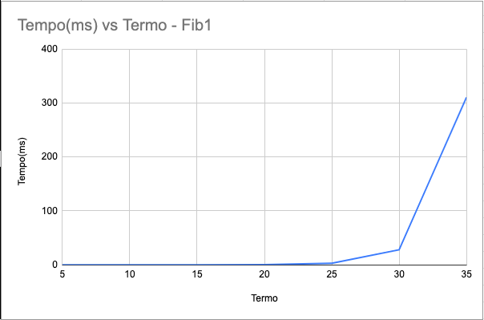
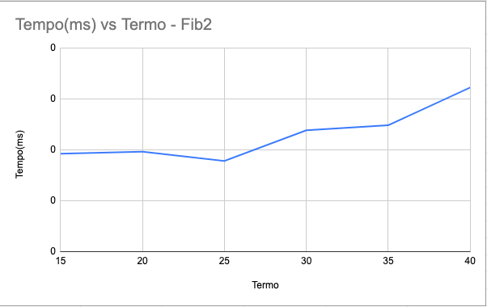

# APA-Avaliação

#### Executando arquivos:

  1 - Navegue até o diretório
  ```
  cd /.../APA-Avaliacao/AV1
  ```
  2 - Compile o arquivo que deseja executar
  ```
  gcc nome_do_arquivo.c -o nome_do_arquivo.out 
  ```      
  3 - Execute o arquivo compilado
  ```
  ./nome_do_arquivo.out
  ```

#### Exemplo
Para executar o arquivo fib1.c, faça:
  ```
  gcc fib1.c -o fib1.out 
  ```   
  e em seguida
  ```
  ./fib1.out
  ```
#
### Roteiro de apresentação

  https://docs.google.com/document/d/1y11qhxGHbB9tpCSE0kJbDxe8IAYzeSG8DxDWFUcPhsI/edit?usp=sharing
#
### Amostra de dados

  https://docs.google.com/spreadsheets/d/18qzO7GPRZEUSBf9hdOBd0IXX41Cddtq7F1TPC9RnrmY/edit?usp=sharing
  

# 

